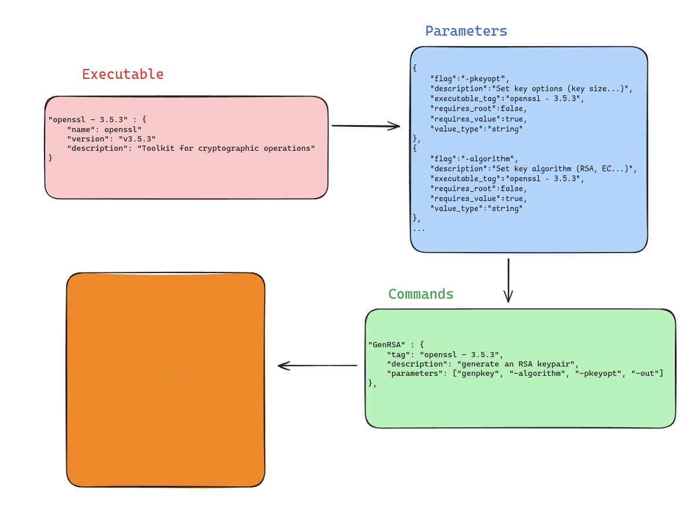

# OTO - workflow automation service

OTO is a golang service for workflow automation. You can schedule executable execution, defined commands and jobs.




# OTO guides

1. [Introduction to OTO](docs/1-introduction.md)
2. [Launch required services](docs/2-services.md)
3. [Try the demo](docs/3-code.md)


# FME : flag matching engine

OTO has recently integrated the `lvlath` library in order to create a flag matching engine. Let me do a quick introduction of this new piece of code.

**What is the flag matching engine ?**

Basically, a **Command** is a set of **Parameter**. But not every parameters can match each other into one Command.
For instance if a command with parameter **b** won't work with parameter **a**, there is no interest in letting the user do so.

OTO is now able to efficiently refuse such commands with the flag matching engine, a program that verify dependencies and conflict between parameters.

Here si the full notebook for further details and in coming fearures [click here](https://github.com/Bl4omArchie/fme)

# Integration of Temporal

The very core of my service is now done and I can now think about scheduling and monitoring larger configuration of executables with a more large amount of commands.
To do so, I have to handle concurrency, events log and more to make a robust solution.
As a solution, I've started the integration of Temporal.io in the `dev` branch where I launch, through a docker compose multiple services like temporal.io, temporal ui, postgresl and my API.

Why Temporal ?
- Event logging
- Metrics
- Workflows and workers for my jobs
- Mature and globally used framework

# Atlas migration

```bash
atlas schema inspect --env gorm --url postgres://${POSTGRES_USER}:${POSTGRES_PASSWORD}@${POSTGRES_HOST}:${POSTGRES_PORT}/${POSTGRES_DATABASE}?sslmode=disable > schema.hcl
atlas migrate diff --env gorm 
atlas migrate apply --env gorm -u postgresql://${POSTGRES_USER}:${POSTGRES_PASSWORD}@${POSTGRES_HOST}:${POSTGRES_PORT}/${POSTGRES_DB}?sslmode=disable
```

# Roadmap

Current work :
- [x] Import/export config to json
- [x] Docker compose deployement
- [x] Write installation guide
- [x] Update AddJob() for map parameter
- [x] Demo with openSSL rsa keypair generation
- [x] Atlas for automatic database migration
- [x] Change ExecutableTag to ExecutableID in Parameter
- [ ] Fix API
- [ ] Add a higher api level for the API (user shouldn't have to add it)
- [ ] Temporal integration : workflows
    - [ ] Finish the activity RunJob
    - [ ] Finish the workflow RunRoutine
- [ ] Temporal integration : scheduling
- [ ] Mock for database (https://github.com/DATA-DOG/go-sqlmock)
